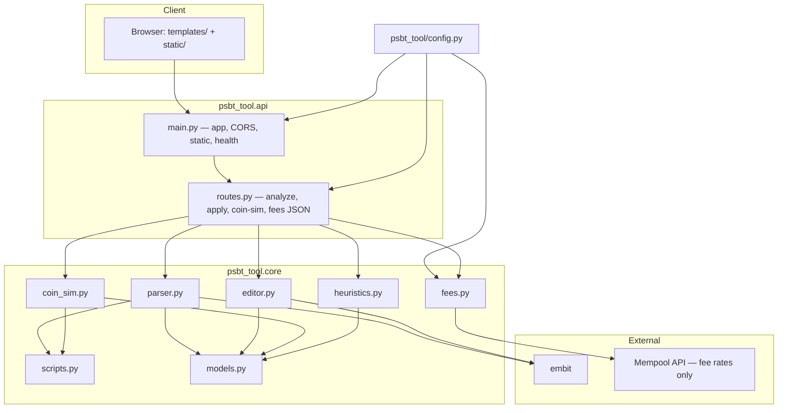

# PSBT Analyzer

A Bitcoin PSBT analysis and optimization tool. Paste, upload, or POST a PSBT and get a human-readable breakdown of inputs, outputs, script types, weight, fees, and change heuristics. Compare coin-selection strategies and edit the PSBT (structured or raw) with live re-analysis.

<details>
<summary><strong>Architecture</strong></summary>

**Summary:**
The app is a single Python service: FastAPI exposes JSON endpoints and serves a Jinja2 + static HTML/JS front end from the same process. All PSBT work happens in-proces*; the only network dependency for v1 is the configured mempool API (fee estimates only, not the PSBT).

**Data flow (high level):**
PSBT in → `api.routes` (validation / decode) → `core.parser` + embit → `PSBTReport` + mempool fee comparison; heuristics optional on outputs; coin-sim and editor read or extend that same report (sim prefill, or apply patches and re-serialize for re-analysis).

**Why this architecture:**
A single process keeps deployment and debugging straightforward for a local or small-team tool: one binary to run, one log stream, and no cross-service versioning of request shapes. Doing all PSBT work in-process avoids shipping partial transaction bytes over extra RPC hops and keeps latency low for analyze → edit → re-analyze loops. The same `PSBTReport` and Pydantic models from parse through sim and editor mean the web UI, JSON API, and tests never drift into incompatible field names or fee semantics. Mempool calls stay optional and narrow (fee buckets only) so the core path remains usable offline or behind strict firewalls, and privacy stays simple: only fee metadata leaves the box, not the PSBT. Finally, embit as the only heavy Bitcoin dependency concentrates protocol risk: BIP-174 parsing and serialization are delegated to a focused library while this repo owns UX, heuristics, and sizing logic.

<details>
<summary><strong>Component graph</strong></summary>


</details>


<details>
<summary><strong>Key components</strong></summary>


| Area                    | Location                       | Role                                                                   | Advantages                                                                                                            |
| ----------------------- | ------------------------------ | ---------------------------------------------------------------------- | --------------------------------------------------------------------------------------------------------------------- |
| HTTP app & CORS         | `psbt_tool/api/main.py`        | FastAPI factory, `GET /` + template, `GET /health`, static mount       | One place to wire middleware, static files, and the SPA-style page; easy health checks for orchestration.             |
| API routes              | `psbt_tool/api/routes.py`      | Analyze (JSON / upload / form), `apply` edits, coin-sim, fees          | Multiple ingest shapes (JSON, form, multipart) without duplicating parse logic; OpenAPI stays accurate for scripting. |
| PSBT parse & report     | `psbt_tool/core/parser.py`     | embit-based decode, `InputView` / `OutputView`, fee + weight           | Single pipeline from raw bytes to a stable report; warnings and fee math live next to decode.                         |
| Script classification   | `psbt_tool/core/scripts.py`    | `scriptPubKey` → P2WPKH / P2TR / P2SH wrap / …; vsize helpers          | Consistent type labels and vsize estimates for parser, sim, and docs; no duplicate magic-byte tables.                 |
| Mempool                 | `psbt_tool/core/fees.py`       | async **httpx** client, short TTL cache, fee-rate buckets              | Bounded outbound traffic and latency; fee “context” degrades cleanly if the API is down.                              |
| Change heuristics       | `psbt_tool/core/heuristics.py` | Scores likely change outputs (non-guarantee)                           | Optional, isolated scoring—easy to read or replace without touching PSBT I/O.                                         |
| Coin selection          | `psbt_tool/core/coin_sim.py`   | Strategy comparison; shares script/vsize types with the parser         | Simulated fees align with analysis assumptions; educational without pretending to be a full wallet.                   |
| Structured edit         | `psbt_tool/core/editor.py`     | Mutates embit `InputScope` / `OutputScope` (source of truth for tx)    | Edits round-trip through the same serializer as real wallets; invalidating sigs on structure change is explicit.      |
| Request/response models | `psbt_tool/core/models.py`     | Pydantic models shared by API, sim, and editor                         | Validation and schema at the boundary; frontend and tests consume one contract.                                       |
| Config                  | `psbt_tool/config.py`          | Env-backed settings (network, mempool URL, size limits)                | Tunable limits and endpoints without code changes; keeps secrets out of source.                                       |
| Web UI                  | `templates/`, `static/`        | One-page tool: analyze, table views, sim, editor, raw PSBT fallback    | No separate frontend build for v1; works behind simple static hosting patterns.                                       |
| Tests                   | `tests/`                       | pytest: fixtures, parser/editor/fees, API integration (mempool mocked) | Fast CI: core logic tested without live mempool; regressions caught on report shape.                                  |
</details>


<details>
<summary><strong>Design Decisions</strong></summary>

Short rationale for major tradeoffs (not an exhaustive spec).

- **Single FastAPI app (API + Jinja/static UI)**
  - Keeps deployment and local dev simple; UI and API scale together rather than as separate services.
- **embit for encode/decode/edit**
  - Offloads BIP-174 correctness to a maintained library; we accept embit’s object model (e.g. mutating PSBT scopes, not ephemeral `tx` fields).
- `PSBTReport` **+ Pydantic at the boundary**
  - One normalized shape for the UI, analyze, sim, and editor; advanced users may still need raw PSBT for uncommon fields.
- **Fee and fee rate** are computed only when every input has a prevout value (`witness_utxo` or `non_witness_utxo`)
  - **Vsize** comes from this project’s script-type model, so estimates can differ slightly from the final witness on-chain
- **Mempool API** supplies recommended fee *context* only (cached TTL); the PSBT is never sent there
  - If the endpoint fails, comparison degrades gracefully
- **Minimal `.env` loader** in `config.py` avoids a `python-dotenv` dependency
  - It is not a full-featured dotenv implementation
- **Open CORS** (`*`) with credentials disabled suits local tooling
  - Tighten origins if you add cookie-based auth or a shared deployment
- `MAX_PSBT_BYTES` limits upload size per process. Raise it in env for unusually large PSBTs.
- **Structured editor** applies a small op set and clears partial/final signatures when the tx changes. The raw base64/hex path remains for edge cases.
- **Change heuristics** are scored hints, not ground truth—see `heuristics.py`
- **Coin-selection sim** is didactic and reuses the same vsize helpers as analysis; it is not a production wallet selector
- `scripts/generate_psbt.py` builds deterministic synthetic PSBTs (same fee/vsize model as the app); not spendable mainnet funds
</details>

<details>
<summary><strong>Features</strong></summary>

- Accept PSBT via file upload, base64/hex text, or raw API body.
- Parse and display:
  - PSBT version (v0 / v2).
  - Per-input and per-output amount, address, script type, weight contribution.
  - Total input value, output value, and inferred fee plus sat/vB fee rate.
- Summary of:
  - Change-output heuristics (with confidence label).
  - Fee reasonableness vs current mempool (via [mempool.space](https://mempool.space/docs/api/)).
  - Script types used and weight / fee implications (segwit and taproot discounts).
- Coin-selection simulator pre-filled from the parsed PSBT (outputs -> targets, inputs -> initial UTXO pool); compare strategies (largest-first, smallest-first, naive branch-and-bound).
- Structured PSBT editor: toggle inputs, edit output amounts, re-serialize, and re-run analysis. Raw base64/hex textarea remains as a fallback.
</details>

</details>

<details>
<summary><strong>Quick Start w/o Docker</strong></summary>

```powershell
# 1. Create venv and install in editable mode
python -m venv .venv
.venv\Scripts\Activate.ps1
pip install -e .[dev]

# 2. Copy env template
copy .env.example .env

# 3. Run the API + UI
uvicorn psbt_tool.api.main:app --reload
```

Alternately, use `scripts/run_app.bat` .

Then open `http://127.0.0.1:8000/` for the web UI or `http://127.0.0.1:8000/docs` for interactive OpenAPI.

</details>

<details>
<summary><strong>Quick Start w/ Docker</strong></summary>

From the project root, with [Docker](https://docs.docker.com/get-docker/) and [Docker Compose](https://docs.docker.com/compose/) installed:

```powershell
docker compose up --build
```

Open `http://127.0.0.1:8000/`. The service listens on `0.0.0.0:8000` inside the container; map a different host port with `HOST_PORT=8100` (or set `HOST_PORT` in a `.env` file next to `docker-compose.yml`).

The image sets `PSBT_ASSET_ROOT=/app` so the UI can find `templates/` and `static/` next to the installed package. Without that, the index page 500s because paths are resolved from the source layout only.

You can still copy `.env.example` to `.env` and edit values: Compose passes `MEMPOOL_BASE_URL`, `NETWORK`, `MEMPOOL_CACHE_TTL`, and `MAX_PSBT_BYTES` into the container. If you omit `.env`, the same defaults as `.env.example` are used.

</details>

<details>
<summary><strong>Generating a sample PSBT</strong></summary>

For local testing, `scripts/generate_psbt.py` writes a **synthetic unsigned PSBT** with P2WPKH inputs and outputs. Keys and prevout txids are **deterministic and not from mainnet**—use only with regtest or tools like this analyzer, not as real funds.

By default, files are written under `**generated_psbts/`** at the project root (the directory is created if needed; `generated_psbts/.gitignore` ignores `*.psbt` so generated binaries are not committed).

From the project root, with the venv activated and the package installed (`pip install -e .[dev]` as in Quick start):

```powershell
python scripts/generate_psbt.py -i 2 -o 2 -f 10 --per-output 100000
```

That example produces `generated_psbts\i2_o2_f10_po100000.psbt` (on Unix, `generated_psbts/i2_o2_f10_po100000.psbt`).


| Flag                | Meaning                                                                              |
| ------------------- | ------------------------------------------------------------------------------------ |
| `-i` / `--inputs`   | Number of inputs (required).                                                         |
| `-o` / `--outputs`  | Number of outputs (required).                                                        |
| `-f` / `--fee-rate` | Fee rate in sat/vB; fee is `ceil(rate × estimated vsize)` (required).                |
| `--per-output`      | Satoshis per output (default `100000`; minimum `546`).                               |
| `-O` / `--out`      | Output **directory** (default: `generated_psbts` in the repo root).                  |
| `--name`            | Filename stem for `STEM.psbt`; if omitted, `iN_oM_fFEE_poSATS` (e.g. `1p5` for 1.5). |


The script prints estimated vsize, rounded fee, and total in/out. Open the `.psbt` in the web UI or pass it to `POST /api/psbt/analyze`.

</details>

<details>
<summary><strong>API</strong></summary>


| Method | Path                       | Purpose                                                                                                                                                               |
| ------ | -------------------------- | --------------------------------------------------------------------------------------------------------------------------------------------------------------------- |
| GET    | `/health`                  | Liveness: status and configured network.                                                                                                                              |
| POST   | `/api/psbt/analyze`        | Analyze a PSBT: JSON with `psbt_base64` and/or `psbt_hex`.                                                                                                            |
| POST   | `/api/psbt/analyze/text`   | Form field `psbt`: **base64** (often mislabeled “hex” in UIs) or real hex. Spaces from url-encoded `+` are fixed; prefer `POST /api/psbt/analyze` JSON to avoid that. |
| POST   | `/api/psbt/analyze/upload` | `multipart/form-data` file `file`: raw PSBT bytes or a text file of base64 (line breaks allowed).                                                                     |
| POST   | `/api/psbt/apply`          | Apply structured `EditOp` list; returns new base64 + `PSBTReport`.                                                                                                    |
| POST   | `/api/coin-sim/bootstrap`  | Parse a PSBT and return a pre-filled `CoinSimRequest` for the sim UI.                                                                                                 |
| POST   | `/api/coin-sim/run`        | Run coin-selection strategies on UTXO / target JSON.                                                                                                                  |
| GET    | `/api/fees/recommended`    | Mempool-style recommended feerates (cached; see `psbt_tool.core.fees`).                                                                                               |


### Testing APIs: HTTP file (`scripts/api.http`)

1. Install a client: [REST Client](https://marketplace.visualstudio.com/items?itemName=humao.rest-client)
  for **VS Code**, or use the built-in HTTP Client in **IntelliJ / WebStorm**.
2. From the project root, start the app: `uvicorn psbt_tool.api.main:app --reload`.
3. Open `[scripts/api.http](scripts/api.http)`. If the server is not on
  `http://127.0.0.1:8000`, edit the `@baseUrl` variable at the top of the file.
4. Send requests with “Send Request” (or your IDE’s equivalent) on each `###` block.
  Most requests use the embedded test PSBT (`@psbtB64`); no file is required for those.
5. For the **file upload** request only: ensure the path under `generated_psbts/`
  exists (for example run `python scripts/generate_psbt.py -i 2 -o 2 -f 10 --per-output 100000`
   or adjust the path in that block to match your `.psbt`).

</details>

<details>
<summary><strong>Backlog</strong></summary>

1. Auto collapse the import section after use
2. Add an export button for the report section
3. Add base64 conversion of the imported file section back
4. Add little informative hover help icons
5. Add history functionality to let you go effectively “undo” edits to the inputs and outputs

</details>

<details>
<summary><strong>Trust and privacy</strong></summary>

- PSBT bytes are parsed locally in this service.
- Only **fee rates** are fetched from the configured mempool endpoint; the PSBT itself never leaves the server.
- See `.env.example` for configuration.

</details>

<details>
<summary><strong>Tests</strong></summary>

```powershell
pytest
```

</details>

